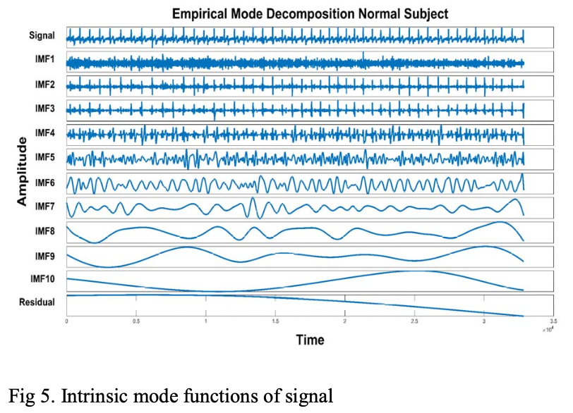

# Coronary Artery Disease Classification using ECG Signals

## 📊 Citation Impact
- **Citations**: 28
- **Unique Contribution**: First work to classify Single Vessel (SVCAD), Double Vessel (DVCAD), and Triple Vessel (TVCAD) Coronary Artery Disease using ECG signals.

## 🔍 Problem Statement
Coronary Artery Disease (CAD) is a leading cause of adult mortality and morbidity globally. Early and accurate detection of CAD types (SVCAD, DVCAD, TVCAD) is crucial for effective treatment. This research presents a novel signal processing approach using ECG signals for automated CAD classification.

## 📑 Dataset
- **Data Collection**: Self-collected dataset from hospitals
- **Equipment**: Bitalino sensor with three electrodes
- **Specifications**:
  - Sampling Frequency: 1000 Hz
  - Signal Duration: 9-12 minutes
  - Total Samples: 643
    - Normal: 300 subjects
    - SVCAD: 105 subjects
    - DVCAD: 90 subjects
    - TVCAD: 115 subjects

## 🔬 Methodology


### 1. Data Acquisition
- Single channel Bitalino with three electrodes
- Electrode Placement:
  - Two electrodes on wrists
  - One electrode on right elbow


### 2. Preprocessing
- Empirical Mode Decomposition (EMD)
- Selected IMFs 2-5 for analysis
- Removal of noise and motion artifacts




### 3. Feature Extraction
Selected features:
- Statistical Features:
  - Skewness
  - Kurtosis
- Shape-based Features:
  - Shape Factor
  - Impulse Factor
  - Marginal Factor
- Energy Features:
  - Energy
  - Root Sum Square
- Entropy Features:
  - Spectral Entropy
  - Energy Entropy
- Other Features:
  - Quantile
  - Higuchi Fractal Dimension

### 4. Classification
- Classifier: Support Vector Machine (SVM)
- Validation: 10-fold cross-validation

## 📈 Results
- Overall Accuracy: 95.5% using Cubic SVM


- Comparative Analysis:
  - Cubic SVM: 95.6%
  - Quadratic SVM: 91.9%
  - Fine KNN: 94.7%
  - Weighted KNN: 93.0%
 
  


## 🔗 Publication
```bibtex
@INPROCEEDINGS{9080694,
  author={Khan, Muhammad Umar and Aziz, Sumair and Hassan Naqvi, Syed Zohaib and Rehman, Abdul},
  booktitle={2020 International Conference on Emerging Trends in Smart Technologies (ICETST)}, 
  title={Classification of Coronary Artery Diseases using Electrocardiogram Signals}, 
  year={2020},
  volume={},
  number={},
  pages={1-5},
  keywords={Electrocardiogram;Empirical Mode decomposition;Coronary Artery Disease;Support Vector Machine;Features Extraction},
  doi={10.1109/ICETST49965.2020.9080694}}
```

## 💻 Technical Specifications
**Bitalino Sensor Specifications:**
- Bandwidth: 0.5-40 Hz
- CMRR: 110 dB
- Range: 0-3 mV
- Gain: 1100

## 📊 Impact
The system provides cardiologists with an effective tool for:
- Early CAD detection
- Classification of CAD types
- Non-invasive diagnosis
- Treatment decision support

---
*Note: This research represents original work in CAD classification using ECG signals, with particular focus on distinguishing between SVCAD, DVCAD, and TVCAD.*
